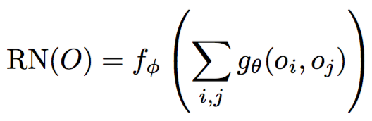
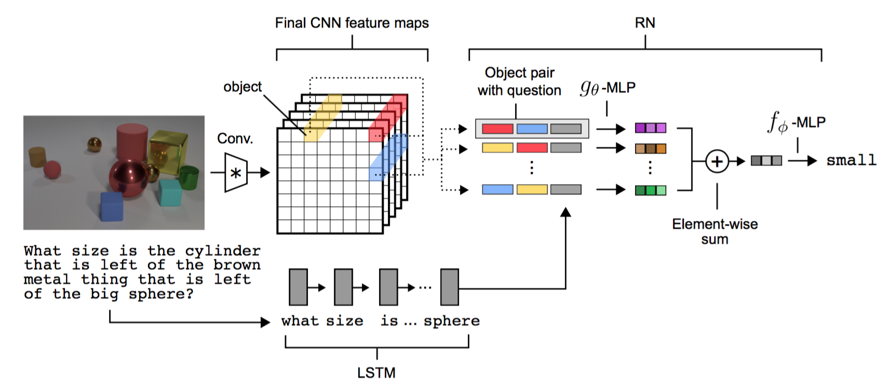

# Sort-of-CLEVR
Tensorflow implementations of Relational Networks and a VQA dataset named Sort-of-CLEVR proposed by DeepMind. In addition to the original approach, few custom questions, both relational and non-relational have also been used.

## Description
This project includes a [Tensorflow](https://www.tensorflow.org/) implementation of **Relation Networks** and a dataset generator which generates a synthetic VQA dataset named **Sort-of-CLEVR** proposed in the paper [A Simple Neural Network Module for Relational Reasoning](https://arxiv.org/abs/1706.01427).

### Relation Networks

Relational reasoning is an essential component of intelligent systems. To this end, Relation Networks (RNs) are proposed to solve problems hinging on inherently relational concepts. To be more specific, RN is a composite function:

<p align="center">
    
</p>

where *o* represents inidividual object while *f* and *g* are functions dealing with relational reasoning which are implemented as MLPs. Note that objects mentioned here are not necessary to be real objects; instead, they could consist of the background, particular physical objects, textures, conjunctions of physical objects, etc. In the implementation, objects are defined by convoluted features. The model architecture proposed to solve Visual Question Answering (VQA) problems is as follows.

<p align="center">
    
</p>

In addition to the RN model, **a baseline model** which consists of convolutional layers followed by MLPs is also provided in this implementation.

### Sort-of-CLEVR

To verify the effectiveness of RNs, a synthesized VQA dataset is proposed in the paper named Sort-of-CLEVR. The dataset consists of paired questions and answers as well as images containing colorful shapes.

Each image has a number of shapes (rectangle or circle) which have different colors (red, blue, green, yellow, cyan, or magenta). Sort-of-CLEVR dataset consists of 6 objects with two uniquue shapes and six colors, one per object. We have a set of twenty three custom written questions comprising of both relational and non-relational questions per image. Here are some examples of images.

Questions are separated into relational and non-relational questions. The questions are encoded into vectors in the following three ways, while answers are represented as one-hot vectors.
* **Approach 1**: The questions and answers are generated in the form of natural language. These are then converted to vectors by assigning a unique integer to a specific word. Corresponding to every unique word token a dictionary is maintained consisting of the word token with its integer value. This way we assign continous integer values to the word tokens in the questions and answers.
* **Approach 2**: In this approach, every question is converted to a vector of length 20 using [Doc2Vec](https://radimrehurek.com/gensim/models/doc2vec.html).
* **Approach 3**: Lastly, we follow the original approach of encoding questions as binary strings to prevent the effect of language parsing and embedding; while answers are represented as one-hot vectors.

Given a queried color, all the possible questions are as follows.

**Non-relational questions**

* Is it a circle or a rectangle?
* Is it closer to the bottom of the image?
* Is it on the left of the image?

**Relational questions**

* The color of the nearest object?
* The color of the farthest object?

**File format**

Generated files use HDF5 file format. Each data point contains an *image*, an one-hot vector *q* encoding a question, and an one-hot vector *a* encoding the corresponding answer.

Note that this implementation only follows the main idea of the original paper while differing a lot in implementation details such as model architectures, hyperparameters, applied optimizer, etc. Also, the design of Sort-of-CLEVR only follows the high-level ideas of the one proposed in the orginal paper.

\*This code is still being developed and subject to change.

## Prerequisites

- Python 3.3+
- [Tensorflow 1.14.0](https://github.com/tensorflow/tensorflow/tree/r1.0)
- [NumPy](http://www.numpy.org/)
- [matplotlib](https://matplotlib.org/)
- [h5py](http://docs.h5py.org/en/latest/)
- [colorlog](https://github.com/borntyping/python-colorlog)
- [sklearn](https://scikit-learn.org/stable/)
- [Doc2Vec](https://radimrehurek.com/gensim/models/doc2vec.html)
- [OpenCV](https://opencv.org/)
- [NLTK](https://www.nltk.org/)

## Usage

### Datasets

Generate a default Sort-of-CLEVR dataset:

```bash
$ python generator.py
```

Or generate your own Sort-of-CLEVR dataset by specifying args:

```bash
$ python generator.py --train_size 12345 --img_size 256
```

\*This code is still being developed and subject to change. The README.md will further be edited to include few more details.
